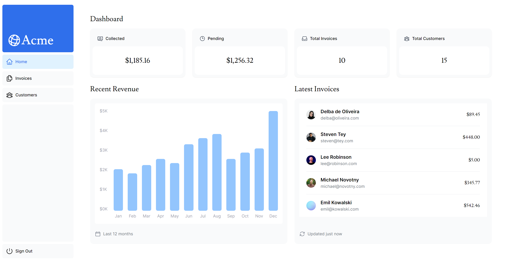
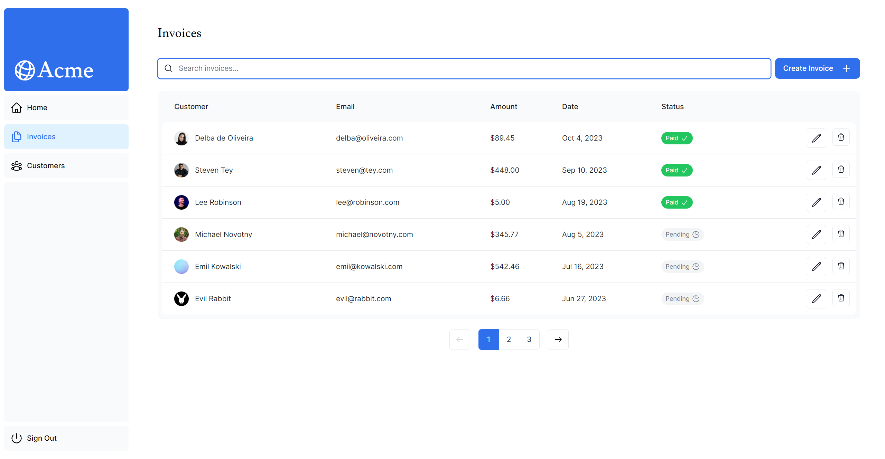
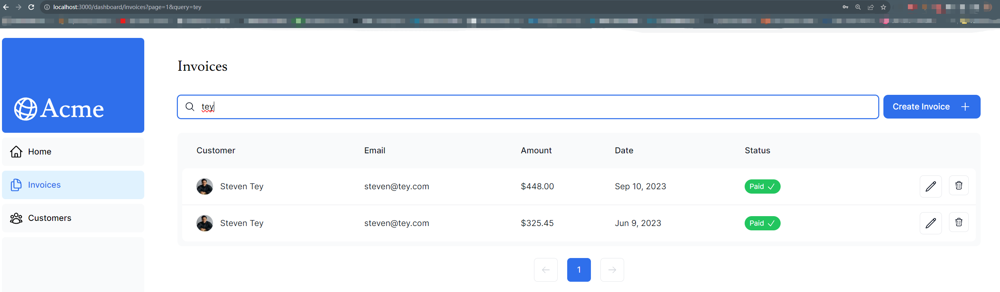

# A Fullstack Next.js project that utilize all Next.js feature

## Features

- Authentication system (Auth.js)
- Next.js App router
- Tailwind
- Skeleton placeholders with React Suspense feature
- SSR and Sever Actions
- Use of sql and vercel postgres database
- Search and Pagination
- Error Handling
- Customized error page and 404 page
- Improved Accessibility and Metadata

## Live Demo

<a href="https://nextjs-dashboard-psi-vert-11.vercel.app" target="_blank">Live Demo Link</a>

---

## Screenshots

### Using URL as search parameters for Search and Pagination 

---
